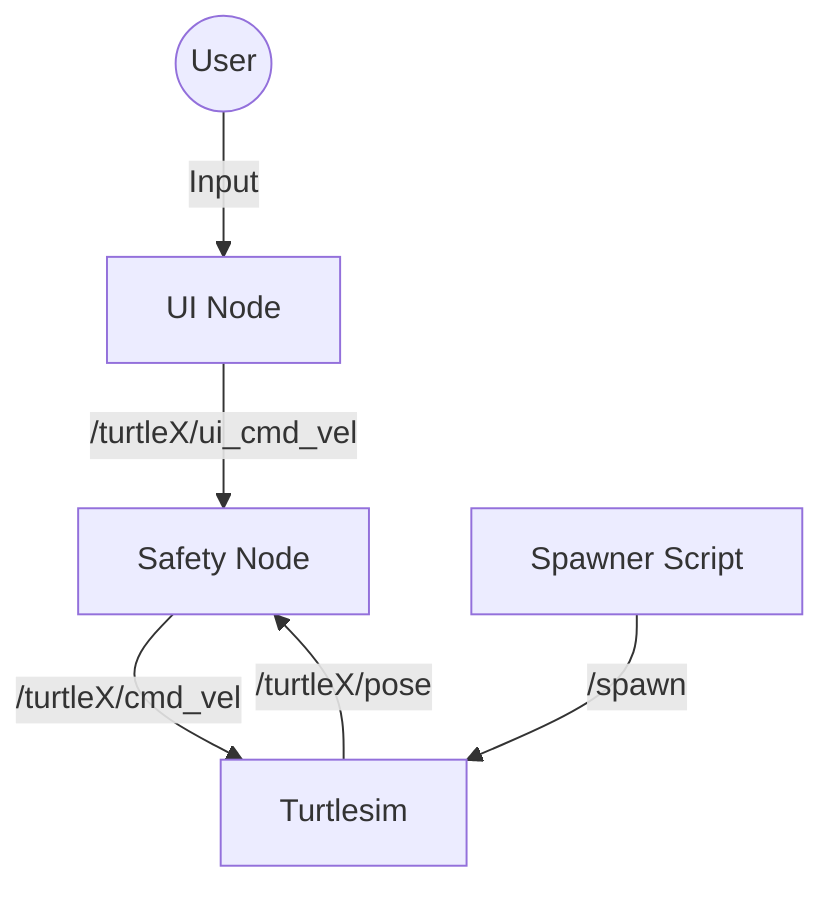

# Safe exploration of the 'Turtlesim' Environment by two turtles

This project implements a ROS2 System that controls the motion of two turtles in the tutlesim simulator, while also enforcing safety contraints against collisions and boundary violations.

## Architecture Sketch

The system consists of three main custom components interacting with the standard `turtlesim` node.


## Component Definitions

### 1. UI Node (`src/ui_node.cpp`)
- **Function**: Provides a command-line interface for the user to control either `turtle1` or `turtle2`.
- **Primitives**: `rclcpp::Node`, `create_publisher`, `std::cin`/`std::cout` for I/O.
- **Algorithm**:
    - Runs a loop prompting the user for:
        1. Turtle selection (1 or 2).
        2. Linear velocity.
        3. Angular velocity.
    - Publishes the command to `/turtle{N}/ui_cmd_vel` for a fixed duration (1.0s).
    - Stops the turtle after the duration.

### 2. Safety Node (`src/safety_node.cpp`)
- **Function**: Ensures safe operation by preventing collisions between turtles and keeping them within defined boundaries.
- **Primitives**: `rclcpp::Node`, `create_subscription`, `create_publisher`, `create_wall_timer`.
- **Algorithm**:
    - **Callbacks**: Updates internal state (pose, last command) from subscriptions.
    - **Control Loop (20Hz)**:
        - Calculates distance between turtles.
        - Calculates distance to boundaries (defined by `wall_min_`, `wall_max_`).
        - **Collision Check**: If distance < `dist_threshold_` and moving closer, stops both turtles.
        - **Boundary Check**: If too close to wall and moving outwards, stops the specific turtle.
        - If safe, forwards the user command to `/turtle{N}/cmd_vel`.
        - If unsafe, stops the turtle(s) and communicates the log warning to the user.

### 3. Spawner (`spawner/turtle_spawn.py`)
- **Function**: Spawns a second turtle (`turtle2`) in the simulation.

## List of Components and Files
```
assignment1_rt/
├── CMakeLists.txt       # Build configuration
├── package.xml          # Package dependencies and metadata
├── Makefile             # Helper for building and running
├── ReadMe.md            # This documentation
├── launch/
│   └── assignment1.launch.py # Launch file (basic)
├── spawner/
│   └── turtle_spawn.py  # Python script to spawn turtle2
└── src/
    ├── safety_node.cpp  # Safety controller source
    └── ui_node.cpp      # User interface source
    ├── util.h           # Utility function header
    └── util.cpp         # Utility function implementation
```

## Installation and Running

### Prerequisites
- ROS2 
- `colcon` build tool
- `turtlesim` package

### Build Instructions
1. To utilize the provided Makefile, navigate to the following directory 
```bash
cd /assignment1_rt/
```
2. Build the package:
```bash
make 
```
3. To launch the entire system with all necessary windows (Simulation, Inspection, UI) automatically:
```bash
make run
```

This will:
1. **Kill previous instances**
2. **Open Turtlesim Simulation**: In a new **tab** of your terminal (plus the graphical window).
3. **Run Spawner**: Automatically adds the second turtle.
4. **Open Safety Node Inspection**: In a **separate new window** to easily monitor safety actions.
5. **Start User Interface**: In a **new tab** of your terminal, where this tab will be focused automatically.

### Using the UI
1. The UI will ask **"Which turtle do you want to control?"**. Enter `1` or `2`.
2. Enter a **Linear Velocity** (e.g., `2.0` for forward, `-1.0` for backward).
3. Enter an **Angular Velocity** (e.g., `1.0` for left turn, `0.0` for straight).
4. If the command passes safety checks, the turtle will move for 1 second.
5. Watch the Safety Node terminal for warnings if any of the turtles encounters an unsafe condition.         
